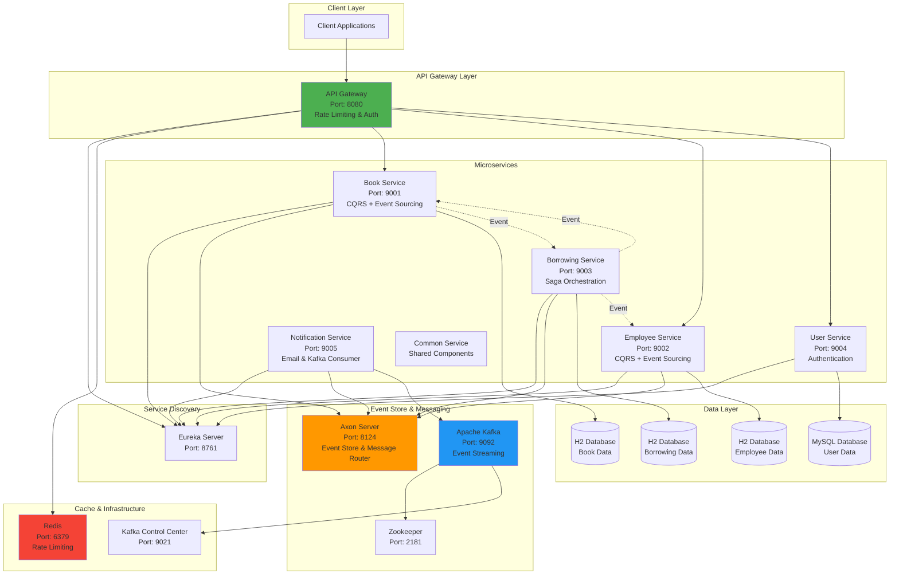
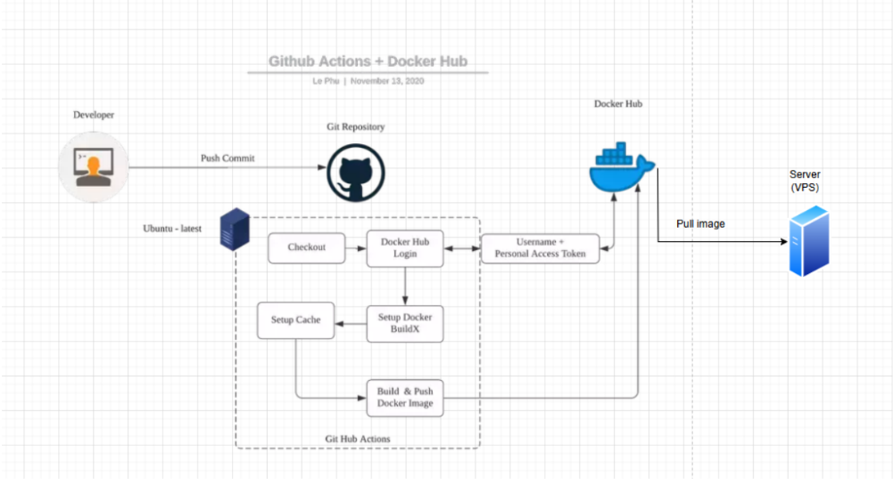

# Library Management System - CQRS & Saga pattern architecture application

A comprehensive microservices-based library management system built with Java Spring Boot, demonstrating modern architectural patterns and cloud-native technologies.






## 📚 About

Libraryx is a library management system that encompasses various aspects and tasks that librarians and users can perform. The system enables:

- **Book catalog management** - Complete CRUD operations for book inventory
- **Book borrowing management** - Track and manage book lending transactions
- **Employee management** - Manage CG employees who can borrow books
- **Real-time notifications** - Send notifications to employees when a book is returned or a new borrowing transaction is created

## 🎯 What You'll Learn From This Project

This project demonstrates practical implementation of modern software architecture patterns and technologies:

1. **Microservices Introduction & Overview**: Explore fundamental concepts of microservices architecture and why it's important in modern software design.

2. **Spring Cloud Netflix Eureka**: Learn about Discovery Server and Discovery Client to build microservice systems with automatic service discovery capabilities.

3. **Domain Driven Design (DDD) & CQRS**: Apply popular architectural patterns to organize and manage project modules effectively.

4. **Event Sourcing & Axon Framework**: Deep dive into Event Sourcing and how to implement it with Axon Framework in your services.

5. **Building & Managing Microservices**: Detailed guidance on building services like BookService and EmployeeService, including exception handling, validation, and Spring Boot related concerns.

6. **API Gateway & Swagger**: Configure and customize API Gateway with Spring Cloud Gateway, while integrating Swagger for automatic API documentation.

7. **Message Queue & Apache Kafka**: Explore how to use Apache Kafka, one of the most popular message queue systems, to integrate messaging in microservices. Learn Kafka installation, handling message loss, and applying Retries and Dead Letter Queue patterns in services like NotificationService.

8. **Saga Pattern**: Apply Saga pattern for managing distributed transactions across services.

9. **Docker & Kubernetes**: Deploy containerized services to Docker and manage them with Kubernetes (K8s).

10. **VPS (Virtual Private Server)**: Deploy the project to VPS using Docker and Nginx.

11. **CI/CD Pipeline**: Build automated deployment pipeline to VPS with GitHub Actions.

12. **Logging & Tracing**: Use Elastic Stack and Zipkin to manage logging and tracing for distributed services.

## 🏗️ Architecture

### Design Principles Applied

**CQRS (Command Query Responsibility Segregation)**
- Applied to services such as Book Service, Employee Service, etc.
- Separates read and write operations for better scalability and performance

**SAGA Pattern**
- Applied to Borrowing Service based on book lending rules to determine when transactions need to be rolled back
- Example: When an employee is disciplined, their borrowing transaction is rejected

### SAGA Workflow

The borrowing process follows this transaction flow:

1. Create a record in the Borrowing table
2. Update book status to "false" (unavailable)
3. Verify the employee is not disciplined before allowing the borrowing

If any step fails, compensating transactions are triggered to rollback previous operations.

## 📡 Main APIs

### Book Service API

| Feature | Method | Endpoint |
|---------|--------|----------|
| Get book details | GET | `/api/v1/books/{bookId}` |
| Add book | POST | `/api/v1/books` |
| Update book | PUT | `/api/v1/books/{bookId}` |
| Delete book | DELETE | `/api/v1/books/{bookId}` |

### Book Borrowing Service API

| Feature | Method | Endpoint |
|---------|--------|----------|
| Get borrowing transactions by employee | GET | `/api/v1/borrowing/{employeeId}` |
| Create borrowing transaction | POST | `/api/v1/borrowing` |
| Update book return status | PUT | `/api/v1/borrowing/{employeeId}/{bookId}` |

### Employee Service API

| Feature | Method | Endpoint |
|---------|--------|----------|
| Get employee information | GET | `/api/v1/employees/{employeeId}` |
| Get list of borrowed books | GET | `/api/v1/employees/{employeeId}/books` |
| Add employee | POST | `/api/v1/employees` |
| Delete employee | DELETE | `/api/v1/employees/{employeeId}` |

### Notification Service

Sends notifications to employees when:
- A book is returned
- A new borrowing transaction is created

## 🛠️ Technologies & Tools

- **Backend Framework**: Spring Boot, Spring Cloud
- **Service Discovery**: Netflix Eureka
- **API Gateway**: Spring Cloud Gateway
- **Event Sourcing**: Axon Framework
- **Message Queue**: Apache Kafka
- **Containerization**: Docker
- **Orchestration**: Kubernetes
- **CI/CD**: GitHub Actions
- **Logging**: Elastic Stack
- **Tracing**: Zipkin
- **API Documentation**: Swagger/OpenAPI
- **Web Server**: Nginx

## 🚀 Getting Started

### Prerequisites

- Java 17 or higher
- Maven 3.6+
- Docker & Docker Compose
- Kubernetes cluster (for K8s deployment)

### Running Locally

```bash
# Clone the repository
git clone https://github.com/nvminh162/library-management-system.git
cd library-management-system

# Run the setup script
./script.sh
```

## 📖 Documentation

For more detailed information, please refer to:
- [CQRS Documentation](./_docs/CQRS.md)
- [Architecture Diagrams](./_docs/readme/)

## 👨‍💻 Author

**@nvminh162**
- GitHub: [@nvminh162](https://github.com/nvminh162)
- Facebook: [@nvminh162](https://facebook.com/nvminh162)
- Instagram: [@nvminh162](https://instagram.com/nvminh162)

## 📝 License

This project is for educational purposes as part of a microservices learning journey.

---


```
 Client (Postman / Browser)
   │
   │  POST /api/v1/books  {"name":"Java Book","author":"nvminh162"}
   ▼
┌──────────────────────────────────────────────────────────────────┐
│ [1] BookCommandController                                        │
│     Nhận request → Tạo CreateBookCommand → Gửi qua CommandGateway│
└──────────────────────┬───────────────────────────────────────────┘
                       │  commandGateway.sendAndWait(command)
                       ▼
┌──────────────────────────────────────────────────────────────────┐
│ [2] Axon Command Bus  (framework tự xử lý, không có code)       │
│     Nhận command → Tìm @CommandHandler phù hợp → Gọi Aggregate  │
└──────────────────────┬───────────────────────────────────────────┘
                       ▼
┌──────────────────────────────────────────────────────────────────┐
│ [3] BookAggregate (@CommandHandler)                               │
│     Validate logic → Tạo Event → AggregateLifecycle.apply(event) │
│                                                                  │
│     apply(event) sẽ làm 3 việc song song:                        │
│       ├─ a. Gọi @EventSourcingHandler → cập nhật state Aggregate │
│       ├─ b. Lưu event vào Event Store (Axon tự động)             │
│       └─ c. Publish event ra Event Bus                           │
└──────────────────────┬───────────────────────────────────────────┘
                       │  Event Bus broadcast
                       ▼
┌──────────────────────────────────────────────────────────────────┐
│ [4] BookEventsHandler (@EventHandler)                             │
│     Lắng nghe event → Tạo JPA Entity → bookRepository.save()     │
│     → INSERT INTO books ...                                      │
└──────────────────────┬───────────────────────────────────────────┘
                       ▼
┌──────────────────────────────────────────────────────────────────┐
│ [5] Response trả về Client                                       │
│     HTTP 200 OK                                                  │
│     Body: "0a977fd5-b39e-4ed3-b833-8fedc698e936" (Book ID)       │
└──────────────────────────────────────────────────────────────────┘
```

```
 Client (Postman / Browser)
   │
   │  GET /api/v1/books
   ▼
┌──────────────────────────────────────────────────────────────────┐
│ [1] BookQueryController                                          │
│     Nhận request → Tạo Query object → Gửi qua QueryGateway      │
└──────────────────────┬───────────────────────────────────────────┘
                       │  queryGateway.query(query, responseType).join()
                       ▼
┌──────────────────────────────────────────────────────────────────┐
│ [2] Axon Query Bus  (framework tự xử lý, không có code)         │
│     Nhận query → Tìm @QueryHandler phù hợp → Gọi Projection    │
└──────────────────────┬───────────────────────────────────────────┘
                       ▼
┌──────────────────────────────────────────────────────────────────┐
│ [3] BookProjection (@QueryHandler)                               │
│     Đọc từ Database → Map sang BookResponseModel → Trả về       │
│                                                                  │
│     bookRepository.findAll()                                     │
│       → SELECT * FROM books                                      │
│       → List<Book> → List<BookResponseModel>                     │
└──────────────────────┬───────────────────────────────────────────┘
                       ▼
┌──────────────────────────────────────────────────────────────────┐
│ [4] Response trả về Client                                       │
│     HTTP 200 OK                                                  │
│     Body: [{"id":"...","name":"Java Book 1","author":"nvminh162", │
│             "isReady":true}, ...]                                 │
└──────────────────────────────────────────────────────────────────┘
```
